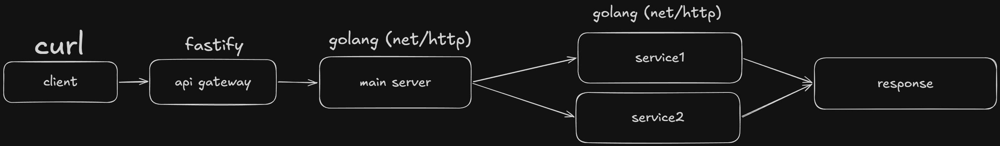
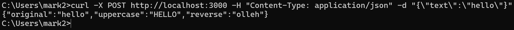

# Microservices Architecture Prototype

Первый архитектурный проект. Распределенная система из 4 микросервисов.

## Архитектура





### Компоненты системы

**API Gateway (Fastify, порт 3000)** — единая точка входа, проксирует запросы в основной сервер.

**Main Server (Go, порт 8080)** — оркестратор, агрегирует данные от микросервисов и возвращает клиенту.

**Service1 (Go, порт 8081)** — микросервис для перевода строки в верхний регистр.

**Service2 (Go, порт 8082)** — микросервис для реверса строки.

## Архитектурные решения

**Почему выбрал Fastify для Gateway?** - потому что это один из самых быстрых веб-фреймворков для node.js, при этом он остается простым.

**Почему Go для сервисов?** - Go очень производительный при минимальном потреблении ресурсов, а его простота позволяет быстро писать надежные микросервисы.

**Почему Main Server не просто прокси, а агрегатор** - чтобы вынести логику оркестрации из апи шлюза, оставив за ним только маршрутизацию, и чтобы микросервисы оставались максимально простыми и независимыми.

**Почему HTTP/REST, а не gRPC** - для прототипа REST проще в реализации и отладке и не требует доп. инструментов для тестирования.

**Почему синхронное взаимодействие** - для данного сценария (обработка текста) не требуется асинхронность, синхронные вызовы проще в реализации и понимании.

## Логика работы

1. Клиент отправляет POST-запрос с JSON `{"text": "hello"}` в Gateway
2. Gateway проксирует запрос в Main Server
3. Main Server параллельно вызывает оба микросервиса:
   - Service1 возвращает `"HELLO"`
   - Service2 возвращает `"olleh"`
4. Main Server агрегирует ответы
5. Клиент получает JSON:
```json
{
  "original": "hello",
  "uppercase": "HELLO",
  "reverse": "olleh"
}
```

## Масштабирование

При росте нагрузки можно горизонтально масштабировать каждый сервис независимо, добавить балансировщик перед Gateway, внедрить кэширование в Main Server или заменить HTTP на gRPC для внутренних вызовов.

## Технологический стек

- **Go 1.25.5** - main server и микросервисы
- **Fastify 4.28** - API Gateway
- **HTTP/REST** - синхронное взаимодействие
- **Git** - контроль версий

## Запуск проекта

```bash
# Терминал 1 - Service1
cd service1 && go run main.go

# Терминал 2 - Service2
cd service2 && go run main.go

# Терминал 3 - Main Server
cd main-server && go run main.go

# Терминал 4 - Gateway
cd gateway && npm install && node server.js
```

## Тестирование

```bash
curl -X POST http://localhost:3000 \
  -H "Content-Type: application/json" \
  -d "{\"text\":\"hello\"}"
```
